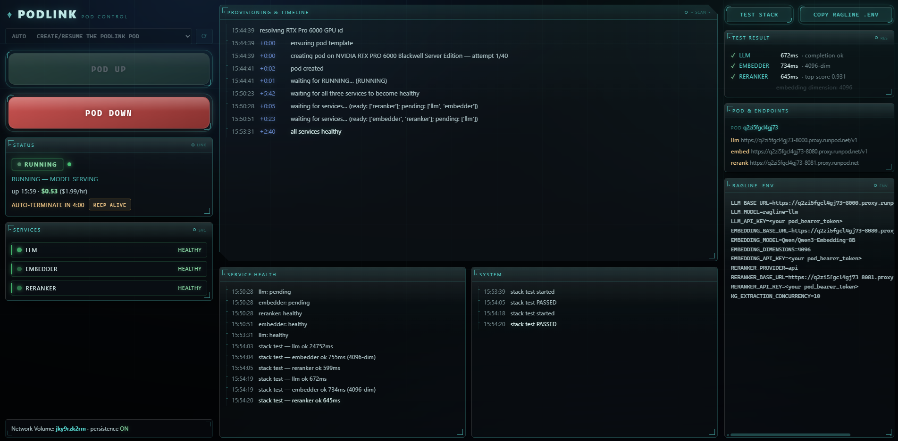

# podlink

A standalone **local web console** for a GPU inference pod on [RunPod](https://runpod.io).
It reduces the pod lifecycle to two buttons — **POD UP** / **POD DOWN** — and surfaces
everything you'd otherwise chase through the RunPod dashboard: provisioning progress,
per-service health, live cost, and the config block your app needs. Bound to
`127.0.0.1` only.

podlink drives one **bundled RAG inference image** (see [`pod_image/`](pod_image/)) that
co-hosts three OpenAI/TEI-compatible services on a single GPU:

| Port | Service | Readiness gate |
|------|---------|----------------|
| 8000 | vLLM — LLM, served as `$LLM_SERVED_NAME` (default `llm`) | `GET /v1/models` → 200 |
| 8080 | TEI — embedder | `GET /health` → 200 |
| 8081 | TEI — reranker | `GET /health` → 200 |

The image, models, and served name are all configurable (see [Configuration](#configuration)),
so podlink is a generic controller for any such three-service RAG pod — not tied to a
particular stack.



## The console

Beyond the two buttons, the UI is a live status console (dark "frosted tactical" skin;
all motion respects `prefers-reduced-motion`):

- **POD UP / POD DOWN** — POD DOWN **terminates** by default, or stops with `PODLINK_LIFECYCLE=stop` (see below), and is live from the
  instant POD UP starts through the whole boot, so you can kill a pod cleanly anytime.
- **Live cost meter** — uptime × the pod's `$/hr`, ticking every second.
- **Idle auto-terminate** — an optional watchdog that terminates a forgotten pod after
  `PODLINK_AUTO_TERMINATE_MIN`; the UI shows a countdown + a **Keep alive** button.
- **Per-service health tiles** — LLM / embedder / reranker, re-probed continuously.
- **Streamed status panels** — Provisioning & timeline (with per-step deltas), Service
  health, and System, split by source; every create-retry and phase shows here.
- **Test stack** — fires a real completion + embedding + rerank at the pod, reporting
  pass/fail + latency and detecting the embedding dimension.
- **Copy .env** — the exact client config block for the running pod (bearer left as a
  placeholder), ready to paste. See [wiring a client](#wiring-a-client).
- **Network Volume** line + a red banner if none is configured (POD DOWN would then
  destroy weights).

## Terminate (default) or stop — and the Network Volume

POD DOWN **terminates** the pod rather than stopping it. A *stopped* pod is pinned to
its original host and can fail to resume when that host has no free GPU
(*"not enough free GPUs on the host machine"*); terminate always releases the GPU
cleanly and the next POD UP creates a fresh pod on **any** host.

So weights survive a terminate, podlink attaches a pre-created RunPod **Network Volume**
(region-locked, survives terminate) at `/workspace`, where the image's
`HF_HOME=/workspace/hf` cache lives. Create it once in **RunPod → Storage → Network
Volumes**, sized **75–100 GB**, in a **data center that stocks your GPU** (the volume
pins the pod to its region). A warm POD UP re-pulls the image but **skips the weight
download** — the payoff of the volume.

> **Cost:** a Network Volume bills storage 24/7 even with no pod running
> (~$4–7/month for 75 GB). When the pod is down there is no GPU cost.

If no volume id is set, podlink falls back to a pod-scoped **Data Volume** that is
**destroyed on terminate** (weights re-download next up). In that mode the UI shows a
warning banner and POD DOWN requires an explicit confirmation.

### Optional: stop/resume (`PODLINK_LIFECYCLE=stop`, RunPod only)

Stopping keeps the pod — and its cached image — on its host, so a successful resume
skips the image pull. The catch is the host-pinning above. With `PODLINK_LIFECYCLE=stop`:

- **POD DOWN** stops the pod (GPU released, verified) and keeps it. A small
  **Terminate instead** button removes it for good, including from IDLE.
- **POD UP** resumes it, retrying *only* "not enough free GPUs on the host machine"
  (`PODLINK_RESUME_RETRIES` × `PODLINK_RESUME_RETRY_DELAY`, default 40 × 15 s), then
  terminates it and creates a fresh pod as usual. Any other resume error falls back
  at once; a resume that comes back with 0 GPUs is stopped again and retried.
- A stopped pod keeps its creation-time image and env, so POD UP only resumes it when
  they still match the active profile (secrets excluded); otherwise it recreates.

Measured 2026-09-23 on an RTX PRO 6000 in EU-RO-1: the stopped pod's GPU was re-rented
within ~20 s and 8/8 resume attempts over 2.5 min failed. When capacity is that tight
most POD UPs will exhaust the retries and fall back, adding up to
`RETRIES × DELAY` to the boot — lower `PODLINK_RESUME_RETRIES` to cap that.

## Quick start

```bash
# 1. one-time: three secrets (Prerequisites) + a stack config (Configuration)
# 2. one-time: create a Network Volume, note its id
./start.sh          # prompts for the Network Volume id (saved), then serves
                    # http://127.0.0.1:8765
./start.sh --check  # preflight only: config + venv/deps + secrets, no launch
```

`start.sh` sources `~/.config/podlink/podlink.conf` (if present) for your stack
config, resolves the Network Volume id (env → saved file → prompt), sets up the venv,
and hands off to the hardened `run.sh` (localhost bind).

## Prerequisites

podlink reads three secrets from `~/.config/podlink/`, each owned by you and mode
`0600` (`_secrets.py` refuses anything more permissive):

| File | What it holds |
|------|---------------|
| `runpod_api_key`   | RunPod API key (create / terminate / GPU lookup). |
| `hf_token`         | Hugging Face token for the weight pull — seen by all three services. |
| `pod_bearer_token` | vLLM + TEI API key; gates all three services; also your client's `*_API_KEY`. |

```bash
mkdir -p ~/.config/podlink && chmod 700 ~/.config/podlink
printf '%s' 'YOUR_RUNPOD_API_KEY'   > ~/.config/podlink/runpod_api_key
printf '%s' 'YOUR_HF_TOKEN'         > ~/.config/podlink/hf_token
printf '%s' 'YOUR_POD_BEARER_TOKEN' > ~/.config/podlink/pod_bearer_token
chmod 600 ~/.config/podlink/*
```

## Configuration

Everything account- or stack-specific is read from the environment — nothing is baked
into source. Put your values in `~/.config/podlink/podlink.conf` (a shell file of
`export`s that `start.sh` sources), or export them yourself:

```bash
# ~/.config/podlink/podlink.conf  (example)
export PODLINK_IMAGE=ghcr.io/you/rag-pod:latest      # your pushed image (required)
export PODLINK_REGISTRY_AUTH_ID=<runpod-cred-id>     # only for a PRIVATE image
export PODLINK_LLM_SERVED_NAME=llm                   # vLLM --served-model-name
export PODLINK_NETWORK_VOLUME_ID=<volume-id>         # terminate-safe weight persistence
```

| Variable | Default | Purpose |
|----------|---------|---------|
| `PODLINK_PROVIDER` | `runpod` | Which cloud this launch drives — one of the packages under `app/providers/`. Set it in a profile to switch clouds per launch. |
| `PODLINK_IMAGE` | *(required)* | The pushed image tag podlink deploys. |
| `PODLINK_REGISTRY_AUTH_ID` | *(empty)* | RunPod Container-Registry-Auth id for a **private** image; empty ⇒ public. |
| `PODLINK_LLM_MODEL_ID` / `PODLINK_EMBED_MODEL_ID` / `PODLINK_RERANK_MODEL_ID` | balanced 96 GB defaults | HF repos the image serves. |
| `PODLINK_LLM_SERVED_NAME` | `llm` | vLLM `--served-model-name`; a client's model field must match. |
| `PODLINK_LLM_QUANT` | *(empty)* | vLLM `--quantization` (empty auto-detects). |
| `PODLINK_NETWORK_VOLUME_ID` | *(empty)* | Network Volume id. Empty ⇒ Data-Volume fallback (weights destroyed on terminate). `start.sh` prompts/saves this. `none` ⇒ **explicitly** volume-less: skips the saved-id/prompt fallback. |
| `PODLINK_MAX_MODEL_LEN` / `PODLINK_GPU_MEMORY_UTILIZATION` | `32768` / `0.70` | vLLM context cap and GPU share (the rest hosts the two TEI services). |
| `PODLINK_VLLM_EXTRA_ARGS` | *(empty)* | Extra `vllm serve` flags, space-separated (e.g. `--language-model-only`, or bounded-multimodal caps). JSON values must be compact — the wrapper word-splits. |
| `PODLINK_PYTORCH_CUDA_ALLOC_CONF` | *(empty)* | Passed to the pod as `PYTORCH_CUDA_ALLOC_CONF` (e.g. `expandable_segments:True`). |
| `PODLINK_VOLUME_GB` | `50` | Pod-scoped Data-Volume size when no Network Volume is set — size it to your weights. |
| `PODLINK_POD_NAME` / `PODLINK_TEMPLATE_NAME` | `podlink` / `podlink-pod` | RunPod pod + template names. |
| `PODLINK_AUTO_TERMINATE_MIN` | `0` (off) | Idle auto-terminate window, minutes (follows `PODLINK_LIFECYCLE`: stops under `stop`). |
| `PODLINK_LIFECYCLE` | `terminate` | `stop` = POD DOWN stops and POD UP resumes, with fallback to terminate + create (RunPod only; see above). |
| `PODLINK_RESUME_RETRIES` / `PODLINK_RESUME_RETRY_DELAY` | `40` / `15` | Stop lifecycle: resume attempts on the pod's host, and seconds between them, before falling back. |
| `PODLINK_READY_WARN_S` / `PODLINK_READY_TIMEOUT_S` | `900` / `3600` | Readiness wait after the pod is RUNNING: warn in the feed every `WARN` seconds and keep waiting (the pod is billing either way); give up only after `TIMEOUT` seconds (`0` = never). Big volume-less boots can take 15–20 min. |
| `PODLINK_ADOPT_ON_START` | `1` (on) | On console start, adopt a RUNNING pod with our name (e.g. after a console restart or a lost start) instead of showing IDLE. |
| `PODLINK_CREATE_RETRIES` / `PODLINK_CREATE_RETRY_DELAY` | `40` / `15` | Host-capacity retry attempts and delay. |
| `PODLINK_START_SSH` | `1` (on) | Enable SSH on the pod for first-boot debug. |

GCP provider (`PODLINK_PROVIDER=gcp`; the shared `PODLINK_*` stack settings above apply unchanged):

| Variable | Default | Purpose |
|----------|---------|---------|
| `PODLINK_GCP_PROJECT` | *(required)* | Project id. |
| `PODLINK_GCP_ZONES` | `europe-west2-b,europe-west2-c` | Zones to place in (one region). A zonal data disk pins to the first; a regional disk or volume-less launch rotates on stockout. |
| `PODLINK_GCP_MACHINE_TYPE` | `g4-standard-48` | 1× RTX PRO 6000 96 GB. |
| `PODLINK_GCP_BOOT_IMAGE` | *(required)* | The golden image (`projects/<p>/global/images/family/<f>`): Ubuntu 24.04 + driver + container toolkit + Docker. |
| `PODLINK_GCP_IMAGE` | `PODLINK_IMAGE` | Container image — use the Artifact Registry mirror in the region. |
| `PODLINK_GCP_DATA_DISK` / `_SCOPE` | *(empty)* / `zonal` | Hyperdisk Balanced name holding Docker's data-root + the HF cache; survives POD DOWN. Empty ⇒ scratch disk destroyed on POD DOWN. `regional` = Hyperdisk Balanced HA. |
| `PODLINK_GCP_CONFIDENTIAL` | `1` | AMD SEV + NVIDIA GPU TEE. |
| `PODLINK_GCP_PROVISIONING` | `standard` | `spot` for the preemptible lane. |
| `PODLINK_GCP_MAX_RUN_HOURS` | `8` | Platform-side kill switch: the VM deletes itself after this. `0` = off. |
| `PODLINK_GCP_DOWN_ACTION` | `delete` | `stop` keeps the boot disk (bills) for a faster restart. |
| `PODLINK_GCP_ACCESS` | `iap` | `iap` = loopback tunnels (no external IP); `internal` = the VM's VPC address. |
| `PODLINK_GCP_LOCAL_PORTS` | `18000,18080,18081` | Loopback ports the IAP tunnels bind (llm, embedder, reranker). |
| `PODLINK_GCP_SERVICE_ACCOUNT` | *(default compute SA)* | The VM's identity — give it Secret Manager accessor on the two secrets and Artifact Registry reader, nothing else. |
| `PODLINK_GCP_SUBNET` / `_NETWORK_TAG` | `default` / `podlink` | Subnet in the region; firewall target tag for the IAP range. |
| `PODLINK_GCP_KMS_KEY` | *(Google-managed)* | CMEK key resource name for both disks. |
| `PODLINK_GCP_SECRET_PREFIX` | `podlink` | Secret Manager names `<prefix>-bearer`, `<prefix>-hf-token`, synced before each create. |
| `PODLINK_GCP_COST_PER_HR` | *(blank meter)* | Hourly rate for the cost meter — GCP reports none on the instance. |
| `PODLINK_GCP_ALLOWED_REGIONS` | `europe-west2` | Zones outside these regions are refused at config time — residency enforced in code until the project is under an org policy. |
| `PODLINK_GCP_HARDENING` | `strict` | `strict` refuses to create a VM without CMEK, a dedicated service account and an in-region image, and fails preflight if logs are not regional. `relaxed` downgrades those to warnings — experiments on non-sensitive data only. |

One-time project setup (regional log bucket, KMS key, VM identity, secrets, registry, firewall,
data disk, optional budget): `deploy/gcp/setup.sh`. The project is expected to start without an
organization and be migrated into an Assured Workloads folder later — `deploy/gcp/MIGRATION.md`
is that checklist, and the hardening above is what keeps the migration an afternoon.

### Profiles — switching between whole stacks

One podlink can drive several model stacks (one at a time — it's one GPU). Put
shared values (image, registry auth) in `podlink.conf` and each stack's settings
in `~/.config/podlink/profiles/<name>.conf`; launch with:

```bash
./start.sh --profile heavy       # sources profiles/heavy.conf AFTER the base conf
./start.sh --check --profile heavy   # verify which stack would deploy, spend nothing
```

Profile files are sourced after the base conf, so their `export`s win. A profile
typically sets the model ids, served name, `PODLINK_MAX_MODEL_LEN`,
`PODLINK_GPU_MEMORY_UTILIZATION`, and its own `PODLINK_NETWORK_VOLUME_ID` — either
a dedicated volume, or the sentinel `none` for a deliberately volume-less stack
(weights re-download each POD UP; the console's red no-volume banner is expected
in that mode, and `PODLINK_VOLUME_GB` should be sized to hold the weights).
`PODLINK_PROFILE=<name>` in the environment does the same as `--profile`; the
active profile and LLM are shown in the console and in `--check`. Models are pod
env, not image content — profiles never need an image rebuild, and same-image
profiles reuse the cached RunPod template.

Switching stacks does not need a relaunch: the console's **profile dropdown**
(above the pod selector) switches the active profile for the next POD UP.
Profile confs are parsed (only `export PODLINK_*` lines are honoured), never
executed, and the switch is only allowed while no pod exists — take the pod
DOWN first. `--profile` at launch simply sets the initial selection.

## Pod image (build once)

POD UP pulls one bundled image running all three services under `supervisord`. Build
and push it, then set `PODLINK_IMAGE`. Full instructions (including the Blackwell
`sm_120` base-image pins) are in [`pod_image/README.md`](pod_image/README.md).

## Wiring a client

Bring the pod up, wait until all three tiles are green, and click **Copy .env** — it
emits the block below with the live pod URLs and the detected `EMBEDDING_DIMENSIONS`,
the bearer left as a placeholder for you to paste from `~/.config/podlink/pod_bearer_token`:

```dotenv
LLM_BASE_URL=https://<pod-id>-8000.proxy.runpod.net/v1
LLM_MODEL=<PODLINK_LLM_SERVED_NAME>          # must match vLLM --served-model-name
LLM_API_KEY=<your pod_bearer_token>
EMBEDDING_BASE_URL=https://<pod-id>-8080.proxy.runpod.net/v1
EMBEDDING_MODEL=<PODLINK_EMBED_MODEL_ID>
EMBEDDING_DIMENSIONS=<detected by Test stack>
EMBEDDING_API_KEY=<your pod_bearer_token>    # TEI is key-gated (public proxy)
RERANKER_PROVIDER=api
RERANKER_BASE_URL=https://<pod-id>-8081.proxy.runpod.net   # root, no /rerank
RERANKER_API_KEY=<your pod_bearer_token>     # TEI is key-gated (public proxy)
```

The pod id (and URLs) **changes on every POD UP** (terminate/recreate), so this is a
per-session block. All three services need the bearer — blank keys → 401 on
embedder/reranker. Switching the embedder changes the vector dimension, so recreate
your vector collection and re-ingest.

## Security

- Bound to `127.0.0.1` only — never exposed on the network.
- State-changing POSTs require a per-process token (`X-Podlink-Token`), blocking
  browser-based CSRF. POD DOWN has a server-side destructive-action guard (refuses to
  terminate without a Network Volume unless the caller confirms). Neither defends
  against a malicious process already running as your user.
- Secrets never reach the browser; only the RunPod driver reads them, and error
  messages carry the exception *type* only (never `str(e)`, which can embed keys).
- The SDK's env-echoing `create_pod` stdout is captured and discarded so secrets don't
  leak to logs.

## Tests

```bash
./.venv/bin/python tests/test_driver_smoke.py   # driver logic (stubbed SDK)
./.venv/bin/python tests/test_session.py        # state machine + snapshot
./.venv/bin/python tests/test_server.py         # routes + guards (FastAPI TestClient)
./.venv/bin/python tests/test_lifecycle.py      # stop/resume lifecycle (stateful fake SDK)
```

## Layout

```
podlink/
├─ start.sh        # launcher (sources config, provider prerequisites, deps, then run.sh)
├─ requirements.txt          # provider-neutral core deps
├─ requirements-runpod.txt   # the RunPod provider's SDK (one file per provider)
├─ run.sh          # hardened uvicorn launch (localhost bind, no arg pass-through)
├─ pod_control/    # vendored pod-control scripts (see PROVENANCE.md)
├─ pod_image/      # bundled 3-service image: Dockerfile + supervisor + wrappers
├─ tests/          # siloing / smoke / session / server tests (no live SDK or GPU needed)
└─ app/
   ├─ session.py         # thread-safe pod state machine + snapshot
   ├─ driver.py          # provider-neutral start/terminate + health/test orchestration
   ├─ preflight.py       # `start.sh --check`: neutral checks + the provider's own
   ├─ providers/         # one PACKAGE per cloud behind a shared contract
   │  ├─ base.py         # the Provider protocol app/driver.py codes against
   │  ├─ __init__.py     # registry: PODLINK_PROVIDER -> package, env normalisation hook
   │  └─ runpod/         # provider.py (the class), launch.sh (pre-venv prompt), __init__.py (hooks)
   ├─ vendored.py        # imports pod_control's cloud-neutral bits (_secrets, egress_logger)
   ├─ profiles.py        # stack profiles: parse confs, swap env, re-bake the provider
   ├─ server.py          # FastAPI routes + SSE + watchdogs
   └─ static/            # the console UI (index.html + app.js)
```

## License

MIT — see [LICENSE](LICENSE).
